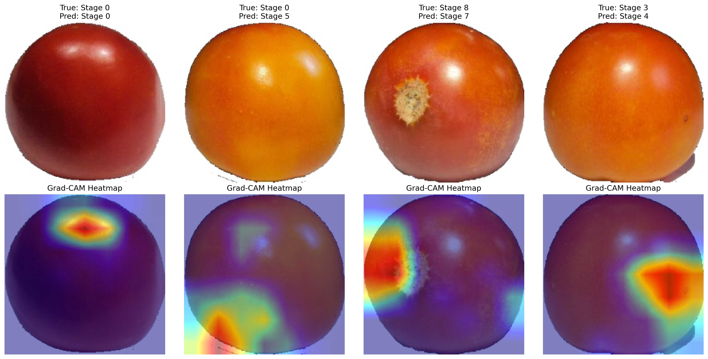

# FreshLiteNet Explainability

To ensure our model is making decisions based on actual biological indicators of decay (rather than background artifacts), we applied **Grad-CAM** (Gradient-weighted Class Activation Mapping). 

Grad-CAM visualizes the specific pixels the neural network is "looking at" when it makes its prediction. In the heatmap, red regions indicate the most important features the model used to determine the freshness stage.

> [!TIP]
> **Observation**
> Notice how the model's heatmaps (red/yellow areas) consistently highlight regions on the tomato skin where physical changes like rotting, bruising, wrinkling, or stem discoloration are occurring. This confirms the **Multi-Scale Freshness Module** combined with the **Efficient Channel Attention** is working exactly as intended to isolate decay features.
